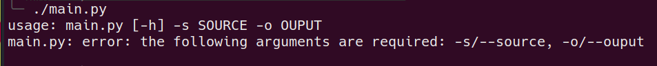

# Python_SIC_Assembler
[](https://www.python.org/)
---
System programming assignment

A simple sic assembler, developed in Python. However, please use it with caution, as it was created by a college student and may have some quirky issues. After all, it's just a class assignment, so it might explode, which is reasonable, ;>.


## Usage: 
```
./main.py -s [input_file] -o [output_file]
```


